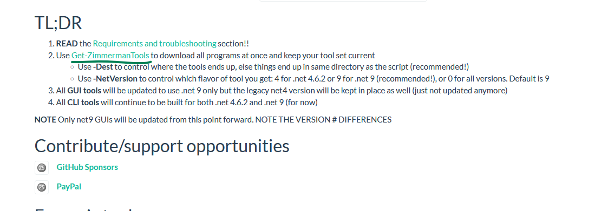
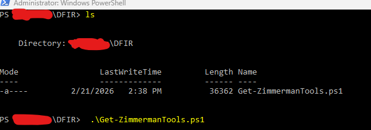
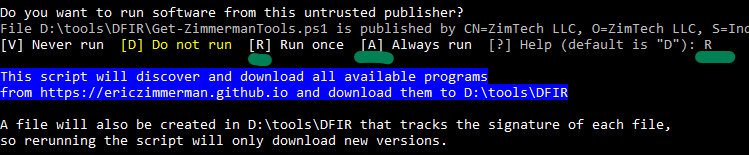
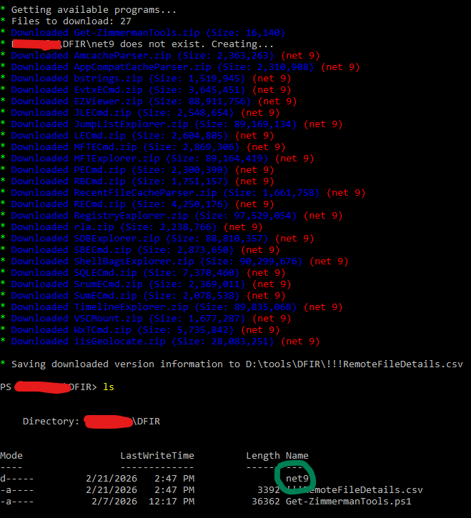

# Zimmerman-Tools-Learning

Eric Zimmerman create a free, open-source suit of DFIR tools. They are often to referred to EZ Tools to help aid people in investigations.

## How to Download?

To download please go to <a href="https://ericzimmerman.github.io/#!index.md">Eric Zimmerman's Website</a> and click on <b>Get-ZimmermanTools</b>. 

You should get a ZIP file like this below. 

Extract this ZIP file wherever you want such as in your C:\ drive or new/other drives. 

After, run Powershell as Administrator, then simply run the file with `.\Get-ZimmermanTools.ps1`. 

Here you can click `R` to run once or `A` to always run. I simply clicked `R` since we only need to run it once. 

Now, you should see a folder called <b>Net9</b>. This contains all the tools that Eric Zimmerman has created where you can play around with them. Some require other components in order to use them, so watch out for that. 

